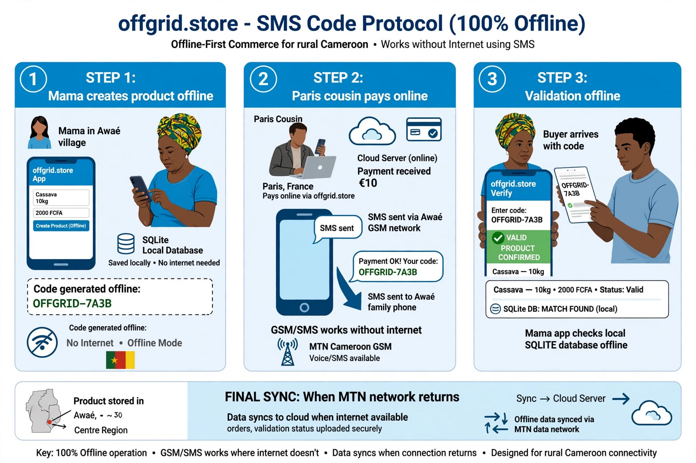

  

 ### How it Works (Concept Diagram)
> *Illustration of the SMS code flow - Conceptual architecture*

# offgrid.store - Commerce Without Internet
> Buy in Paris, collect in Awaé. An offline-first protocol for rural Cameroon.

**Author:** KANKO DJOUA MIGUEL - BSc Computer Science Year 1, Institut Africain d'Informatique (IAI), Yaoundé  
**Location:** Awaé, Centre Region, Cameroon  
**Contact:** kankodjouamiguel@gmail.com  
**Goal:** Build the first offline marketplace dataset from rural Cameroon for PhD Research (UT Dallas 2029) on Offline-First Systems.

### The Problem 
In Awaé, near Yaoundé:
- 60% of sellers have no stable internet. When MTN cuts, business stops.
- Farmers lose ~40% of harvest because they can't find buyers offline.
- Apps like Jumia need 100% internet. They don't work here.
- 6 Million Cameroonians in the diaspora (France/USA) want to buy for their family in the village, but can't send Mobile Money to someone who is offline.

### The Vision: How it Will Work
Not an app that needs internet, but a protocol that works without it.
 
**1. 100% Offline Vendor App:** A mama in Awaé can add "1 bag of cassava - 15.000 FCFA" on her phone with ZERO internet. It's saved locally (SQLite).

**2. The SMS Code System (No Internet Needed):** The app generates a code offline: `OFFGRID-7A3B: 1 bag of cassava from Mary - Awaé Market`. The buyer just shows this code. No smartphone needed to collect.

**3. Diaspora Mode:** My cousin in Paris pays on offgrid.store website (online). The system sends an SMS to the family in Awaé with the collection code. The village seller validates the code OFFLINE from her app.

**4. Auto-Sync:** When MTN network comes back, all the offline sales sync automatically to the cloud.

### Fieldwork Log - Awaé Market (Current)
This is not just an idea. I started field research:

- **Sept 2026:** Interviewed 12 sellers at Awaé Market (2h each) - Main finding: MTN cuts 3-4h/day, they lose clients
- **Products listed:** 50 real products documented with real prices (water, plantain, palm oil, etc.) in FCFA
- **Test:** Tested SMS collection logic with my aunt - validated that code system can work without internet
- **Next:** Interview 38 more sellers to reach 50

### Why This Matters for Research
This will be the first dataset of real offline commerce from rural Cameroon.
- **Research Topics:** Offline-First Distributed Systems (CRDTs), SMS-based consensus, FinTech for Diaspora, Offline AI for local languages (Ewondo, Bassa).
- **Impact:** A solution for the 60% of Cameroonians excluded from e-commerce.

### Current Status: IDEA & RESEARCH PHASE
I am currently in Year 1 at IAI (2025-2026). I am learning to code. This repository is for documenting the idea, the field research in Awaé market, and the learning roadmap.

**Phase 1 (Now - Year 1):** Field Research. Interview 50 sellers. List 50 products. Learn Dart/Flutter basics.  
**Phase 2 (Year 2):** Build Offline Core. Flutter + SQLite offline storage + offline code generator.  
**Phase 3 (Year 3):** Build Sync + SMS. Implement auto-sync and test with MTN MoMo sandbox + SMS Gateway.  
**Phase 4 (Master):** Deploy pilot in Awaé + Publish dataset.

### Tech Stack (Planned)
Flutter, SQLite, Firebase (for sync only), MTN MoMo API, SMS Gateway / USSD

### Inspired by
@sanix-darker and the OSS Cameroon community - building simple tools for complex African problems.

---
**I am looking for mentors in Offline-First Systems and Mobile Money. If you work on this, please reach out: kankodjouamiguel@gmail.com**
